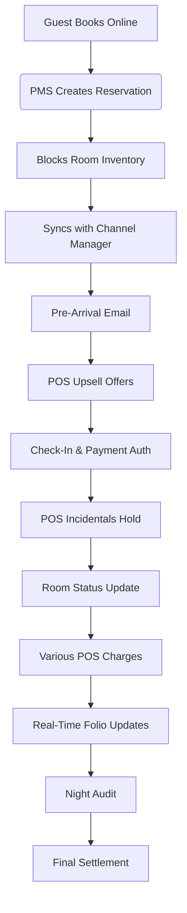

Here's a story-based explanation of how POS (Point of Sale) and PMS (Property Management System) work together in a hotel, following a guest's journey:

**The Tale of the Seaview Hotel: A Day in the Life of Systems**

---

### **Chapter 1: Reservation & Pre-Arrival**  
*Guest: Sarah, a business traveler*

1. **Online Booking (PMS)**:  
   Sarah books via the hotel website → PMS automatically:  
   - Creates reservation ID (#4567)  
   - Blocks Room 304 (Deluxe King)  
   - Triggers automated confirmation email  
   - Syncs with channel manager to mark room as "booked" on OTAs  

2. **Pre-Arrival Upsell (PMS + POS Integration)**:  
   PMS sends pre-arrival email:  
   - Offers spa package ($150) ← Integrated with spa POS  
   - Suggests dinner reservation ← Tied to restaurant POS  

---

### **Chapter 2: Check-In**  
*Front Desk Agent: Mark*

3. **Identity Verification**:  
   Mark scans Sarah's ID → PMS auto-fills registration card  

4. **Payment Authorization**:  
   Swipes credit card → POS system:  
   - Places $200 hold for incidentals  
   - PMS updates folio with authorization code  

5. **Room Assignment**:  
   PMS shows Room 304 ready ← Housekeeping status updated via mobile POS  

---

### **Chapter 3: During Stay**  

6. **Restaurant Charge (POS)**:  
   Sarah orders $35 dinner → Restaurant POS:  
   - Adds charge to Folio #4567  
   - PMS instantly shows pending $35 balance  

7. **Spa Booking (POS Integration)**:  
   Front desk books massage → Spa POS:  
   - Reserves 2 PM slot  
   - PMS adds $150 charge with service details  

8. **Mini-Bar Restock (Mobile POS)**:  
   Housekeeping scans used items →  
   - Auto-adds $12 to folio  
   - Triggers restock request  

---

### **Chapter 4: Night Audit**  

9. **Automated Reconciliation (PMS)**:  
   At 2 AM, PMS:  
   - Closes daily financials  
   - Pushes restaurant POS data to accounting  
   - Generates housekeeping reports  

---

### **Chapter 5: Check-Out**  

10. **Folio Review**:  
    PMS displays all charges:  
    - Room rate: $299/night  
    - POS charges: $35 (dinner) + $150 (spa) + $12 (minibar)  

11. **Payment Settlement**:  
    POS system:  
    - Releases $200 hold  
    - Charges final $496 balance  
    - Prints itemized receipt  

---

### **Visual Workflow Summary**  

This integrated workflow ensures:  
1. Real-time folio updates across all departments  
2. Automatic inventory management  
3. Centralized payment processing  
4. Compliance with PCI standards  
5. Seamless guest experience from booking to departure  

Would you like me to elaborate on any specific part of this workflow?

---
Answer from Perplexity: https://www.perplexity.ai/search/do-you-know-about-paidyet-y64017h7Qeu0ug6tJvA.iQ?login-source=visitorGate&login-new=false&utm_source=copy_output

✅ Push development Branch to GitHub
bash
Copy
Edit
git push github development
This will sync the latest development branch from GitLab to GitHub.

git push github development

🔁 (Optional) Sync Both Remotes with One Command
You can even push to both at once:
git push --all origin
git push --all github
